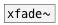

[<<< reference home](ceammc_lib.md)
---

# xfade2~

```

                             
[osc~ 440]    [osc~ 1000]   [ui.knob]
|             |             |
| [osc~ 441]  | [osc~ 1002] |
| |           |   |         |
| |           |   |         [F]
| |.          |.. |...      |....
[xfade2~ 2                        ]
|  ^|
|   |   [ui.slider @size 120 16]
|   |.  |..
[gain~   2]
| ^|.
[dac~]

            
```
---
multi stereo-signal crossfade
---
arguments:

N: number of signal inputs
            (multiplied 2)<br>

---
properties:

@smooth(ms): 
            signal change smooth time<br>
@type: fade curve type:
            linear or power<br>
@lin: alias to @type lin<br>
@pow: alias to @type pow<br>

---
see also:<br>
[](xfade~.md)
