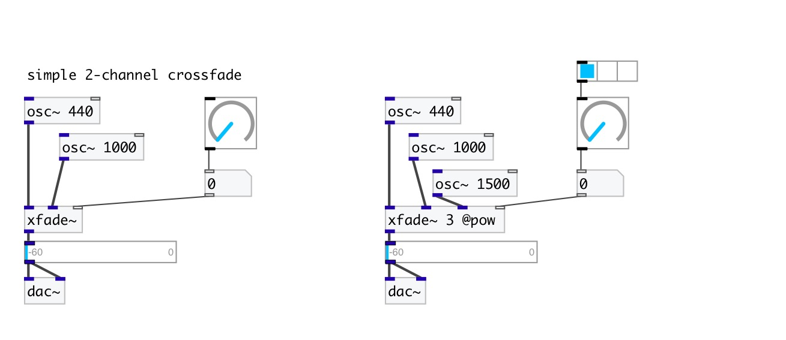

[< reference home](index.html)
---

# xfade~

multi signal crossfade

---

control float value in range [0-1) controls xfade between first and second
            signals, [1-2) between second and third etc.
 

---

---
arguments:

N: number of inputs 

---
properties:

@smooth(ms): 
            signal change smooth time 
@type: fade curve type:
            linear or power 
@lin: alias to @type lin 
@pow: alias to @type pow 

