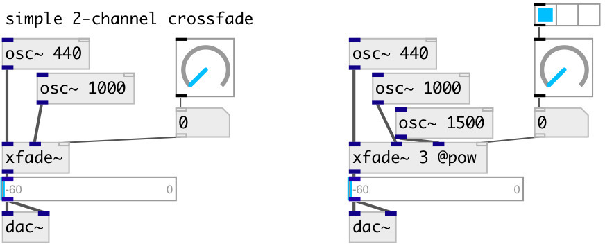

[index](index.html) :: [base](category_base.html)
---

# xfade~
**aliases:** [ceammc/xfade\~]

###### multichannel crossfade

*available since version:* 0.6

---

## information
control float value in range [0-1) controls xfade between first and second signals, [1-2) between second and third etc.

## arguments:

* **N**
number of inputs 
_type:_ int 

* **X**
crossfade init value. Valid value in [0..N-1] range. See @x property 
_type:_ float 

## properties:

* **@lin** 
Get/set alias to @type lin 
_type:_ alias 

* **@n** (initonly)
Get/set number of xfade inputs 
_type:_ int 
_range:_ 2..16 
_default:_ 2 

* **@pow** 
Get/set alias to @type pow 
_type:_ alias 

* **@smooth** 
Get/set signal change smooth time 
_type:_ float 
_units:_ ms 
_min value:_ 1 
_default:_ 20 

* **@type** 
Get/set fade curve type: linear or power 
_type:_ symbol 
_enum:_ lin, pow 
_default:_ pow 

* **@x** 
Get/set crossfade property. Valid value in [0..N-1] range. 
_type:_ float 
_default:_ 0 

## inlets:

* input signal 
_type:_ audio
* input signal 
_type:_ audio
* input signal 
_type:_ audio
* set crossfade value 
_type:_ control

## outlets:

* output signal 
_type:_ audio

## keywords:

[crossfade](keywords/crossfade.html)
[xfade](keywords/xfade.html)

**Authors:** Serge Poltavsky

**License:** GPL3 or later

