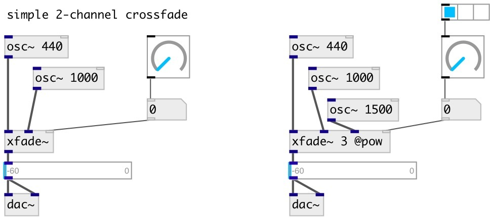

[index](index.html) :: [base](category_base.html)
---

# xfade~

###### multi signal crossfade

*available since version:* 0.6

---

## information
control float value in range [0-1) controls xfade between first and second
            signals, [1-2) between second and third etc.

## arguments:

* **N**
number of inputs 
__type:__ int 

## properties:

* **@smooth** 
Get/set signal change smooth time 
__type:__ float 
__units:__ ms 
__min value:__ 1 
__default:__ 20 

* **@type** 
Get/set fade curve type: linear or power 
__type:__ symbol 
__enum:__ lin, pow 
__default:__ pow 

* **@lin** 
Get/set alias to @type lin 
__type:__ alias 

* **@pow** 
Get/set alias to @type pow 
__type:__ alias 

## inlets:

* input signal 
__type:__ audio 
* input signal 
__type:__ audio 
* input signal 
__type:__ audio 
* set crossfade value 
__type:__ control 

## outlets:

* output signal
__type:__ audio 

## keywords:

[crossfade](keywords/crossfade.html)
[xfade](keywords/xfade.html)

**Authors:** Serge Poltavsky

**License:** GPL3 or later

