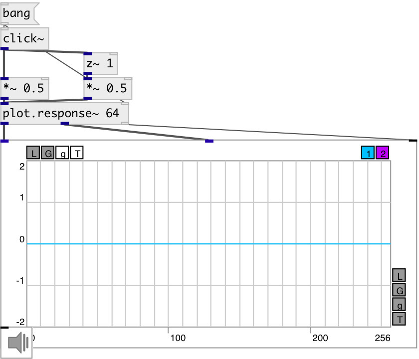

[index](index.html) :: [base](category_base.html)
---

# z~
**aliases:** [ceammc/z\~]

###### sample delay

*available since version:* 0.9.5

---

## arguments:

* **Z**
delay length 
_type:_ int 
_units:_ samp 

## properties:

* **@z** 
Get/set delay length 
_type:_ int 
_units:_ samp 
_range:_ 0..512 
_default:_ 1 

## inlets:

* input signal 
_type:_ audio
* set delay length 
_type:_ control

## outlets:

* output signal 
_type:_ audio

## keywords:

[delay](keywords/delay.html)
[z](keywords/z.html)

**Authors:** Serge Poltavsky

**License:** GPL3 or later

