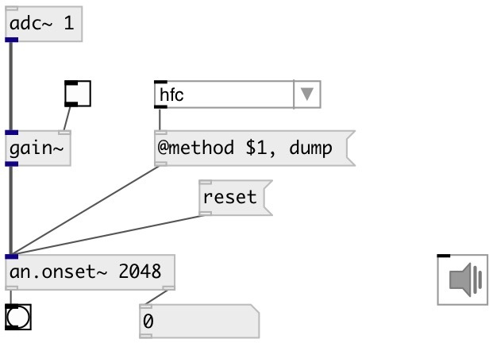

[index](index.html) :: [an](category_an.html)
---

# an.onset~

###### onset detector

*доступно с версии:* 0.9

---

## информация
Onset detector based on aubio library

## аргументы:

* **BS**
buffer size 
_тип:_ int 
_единица:_ samp 

* **METHOD**
detection method 
_тип:_ symbol 

* **HS**
hop size (by default buffer_size/2) 
_тип:_ int 

## методы:

* **reset**
reset onset last frame and total frames counters 

## свойства:

* **@bs** 
Получить/установить buffer size 
_тип:_ int 
_единица:_ samp 
_минимальное значение:_ 64 
_по умолчанию:_ 1024 

* **@hs** 
Получить/установить hop size. 0 means @bs/2 
_тип:_ int 
_единица:_ samp 
_минимальное значение:_ 0 
_по умолчанию:_ 0 

* **@method** 
Получить/установить onset method. Default is hfc. 
_тип:_ symbol 
_варианты:_ specflux, phase, energy, hfc, kl, complex, default, specdiff, wphase, rolloff, spread, kurtosis, skewness, complexdomain, decrease, slope, centroid 
_по умолчанию:_ default 

* **@hfc** 
Получить/установить alias to @method hfc. High Frequency Content onset detection 
_тип:_ alias 

* **@energy** 
Получить/установить alias to @method energy. Energy based onset detection function 
_тип:_ alias 

* **@complex** 
Получить/установить alias to @method complex. Complex Domain Method onset detection function 
_тип:_ alias 

* **@phase** 
Получить/установить alias to @method phase. Phase Based Method onset detection function 
_тип:_ alias 

* **@wphase** 
Получить/установить alias to @method phase.Weighted Phase Deviation onset detection function 
_тип:_ alias 

* **@specdiff** 
Получить/установить alias to @method specdiff. Spectral difference method onset detection function 
_тип:_ alias 

* **@kl** 
Получить/установить alias to @method kl. Kullback-Liebler onset detection function 
_тип:_ alias 

* **@mkl** 
Получить/установить alias to @method mkl. Modified Kullback-Liebler onset detection function 
_тип:_ alias 

* **@specflux** 
Получить/установить alias to @method specflux. Spectral Flux 
_тип:_ alias 

* **@threshold** 
Получить/установить peak picking threshold 
_тип:_ float 
_по умолчанию:_ 0.058 

* **@speedlim** 
Получить/установить minimum interval between two consecutive onsets 
_тип:_ float 
_единица:_ ms 
_минимальное значение:_ 1 
_по умолчанию:_ 50 

* **@silence** 
Получить/установить onset detection silence threshold 
_тип:_ float 
_единица:_ db 
_диапазон:_ -80..0 
_по умолчанию:_ -70 

* **@compression** 
Получить/установить lambda logarithmic compression factor, 0 to disable 
_тип:_ float 
_минимальное значение:_ 0 
_по умолчанию:_ 1 

* **@awhitening** 
Получить/установить adaptive whitening 
_тип:_ int 
_варианты:_ 0, 1 
_по умолчанию:_ 0 

* **@delay** 
Получить/установить constant system delay to take back from detection time 
_тип:_ float 
_единица:_ ms 
_минимальное значение:_ 0 
_по умолчанию:_ 49.9093 

* **@active** 
Получить/установить audio processing state 
_тип:_ int 
_варианты:_ 0, 1 
_по умолчанию:_ 1 

## входы:

* input signal 
_тип:_ audio

## выходы:

* bang if onset detected 
_тип:_ control
* output time of the latest onset detected in millisecond 
_тип:_ control

## ключевые слова:

[onset](keywords/onset.html)

**Смотрите также:**
[\[an.onset\]](an.onset.html)

**Авторы:** Serge Poltavsky

**Лицензия:** GPL3 or later

