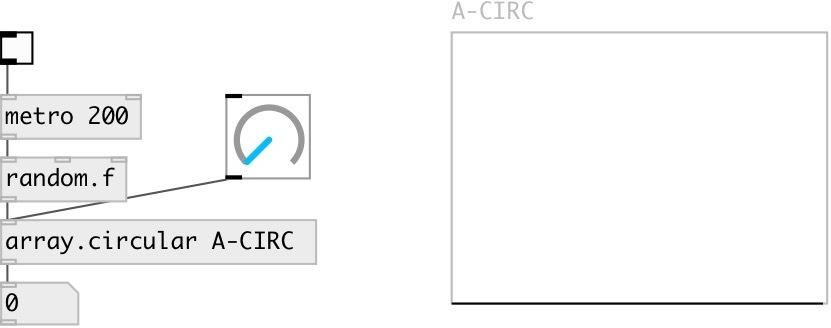

[index](index.html) :: [array](category_array.html)
---

# array.circular

###### array read/write as circular buffer

*доступно с версии:* 0.9.5

---

## аргументы:

* **ARRAY**
array name 
_тип:_ symbol 

## свойства:

* **@array** 
Запросить/установить array name 
_тип:_ symbol 

* **@redraw** 
Запросить/установить array redraw after change 
_тип:_ bool 
_по умолчанию:_ 1 

## входы:

* push back new float 
_тип:_ control

## выходы:

* float: popped front element 
_тип:_ control

## ключевые слова:

[array](keywords/array.html)
[circular](keywords/circular.html)

**Смотрите также:**
[\[array.circular~\]](array.circular~.html)

**Авторы:** Serge Poltavsky

**Лицензия:** GPL3 or later

