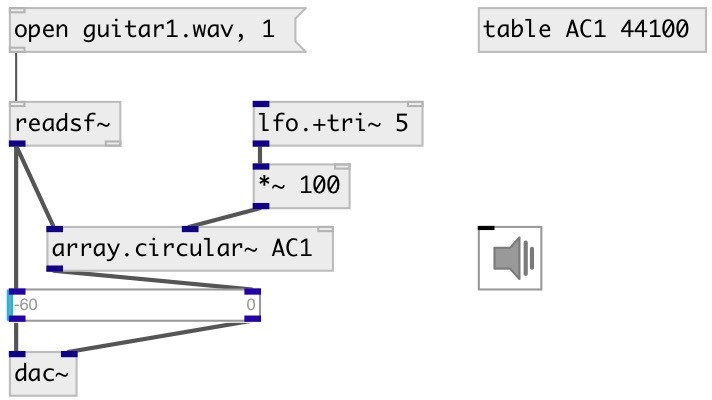

[index](index.html) :: [array](category_array.html)
---

# array.circular~

###### circular buffer for arrays

*доступно с версии:* 0.9.4

---

## аргументы:

* **ARRAY**
array name 
_тип:_ symbol 

* **ON**
write mode 
_тип:_ bool 

## методы:

* **resize**
resize target array 
  __параметры:__
  - **SZ** new size 
    тип: int  
    единица: samp  
    обязательно: True  

## свойства:

* **@array** 
Запросить/установить array name 
_тип:_ symbol 

* **@on** 
Запросить/установить write mode 
_тип:_ bool 
_по умолчанию:_ 1 

* **@interp** 
Запросить/установить interpolation mode 
_тип:_ int 
_варианты:_ 0, 1, 3 
_по умолчанию:_ 0 

## входы:

* write delay 
_тип:_ audio
* read delay 
_тип:_ audio
* reset write position to zero 
_тип:_ control

## выходы:

* read signal 
_тип:_ audio

## ключевые слова:

[array](keywords/array.html)
[circular](keywords/circular.html)
[ring](keywords/ring.html)

**Авторы:** Serge Poltavsky

**Лицензия:** GPL3 or later

