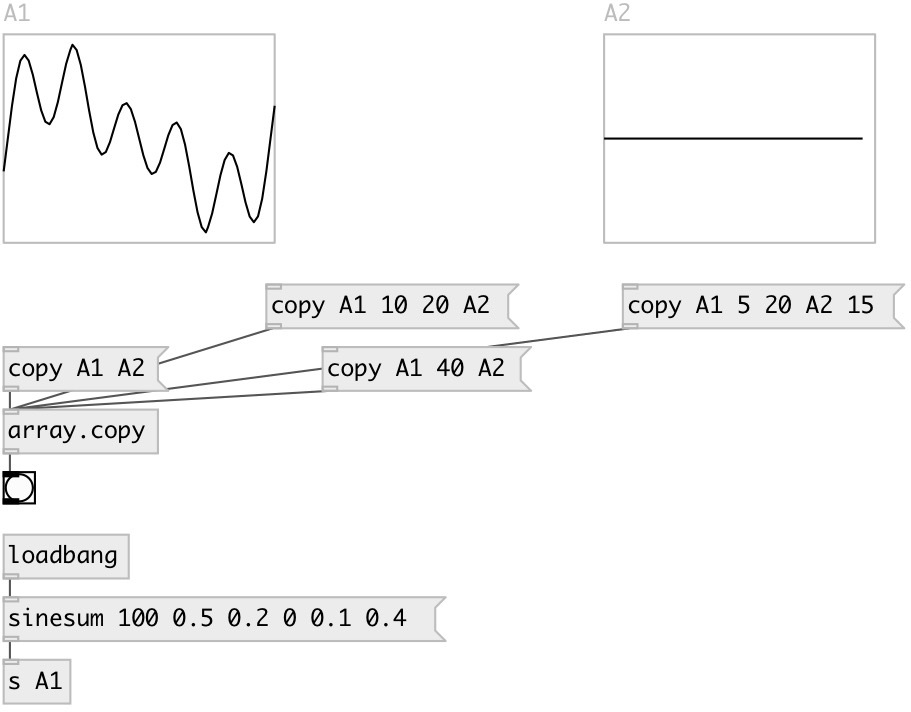

[index](index.html) :: [array](category_array.html)
---

# array.copy

###### copy samples from one array to another

*доступно с версии:* 0.3

---

## методы:

* **copy . .**
copy the whole array content 
  __параметры:__
  - **SRC** the source array 
    тип: symbol  
    обязательно: True  

  - **DST** the destination array 
    тип: symbol  
    обязательно: True  

* **copy . . .**
copy the array content from the specified position till the end 
  __параметры:__
  - **SRC** the source array 
    тип: symbol  
    обязательно: True  

  - **FROM** source start position 
    тип: int  
    обязательно: True  

  - **DEST** the destination array 
    тип: symbol  
    обязательно: True  

* **copy . . . .**
copy the array content from the specified range 
  __параметры:__
  - **SRC** the source array 
    тип: symbol  
    обязательно: True  

  - **FROM** the source start range 
    тип: int  
    обязательно: True  

  - **TO** the source end range 
    тип: int  
    обязательно: True  

  - **DEST** the destination array 
    тип: symbol  
    обязательно: True  

* **copy . . . . .**
copy the array content from the specified range and to the specified
destination position 
  __параметры:__
  - **SRC** the source array 
    тип: symbol  
    обязательно: True  

  - **FROM** the source start range 
    тип: int  
    обязательно: True  

  - **TO** the source end range 
    тип: int  
    обязательно: True  

  - **DEST** the destination array 
    тип: symbol  
    обязательно: True  

  - **DEST_FROM** the destination start position 
    тип: int  
    обязательно: True  

## свойства:

* **@resize** 
Запросить/установить resizing of destination array on overflow 
_тип:_ bool 
_по умолчанию:_ 0 

## входы:

* FROM TO - copy data from the one array to another 
_тип:_ control

## выходы:

* bang on finish 
_тип:_ control

## ключевые слова:

[array](keywords/array.html)
[copy](keywords/copy.html)

**Смотрите также:**
[\[array.each\]](array.each.html)

**Авторы:** Serge Poltavsky

**Лицензия:** GPL3 or later

