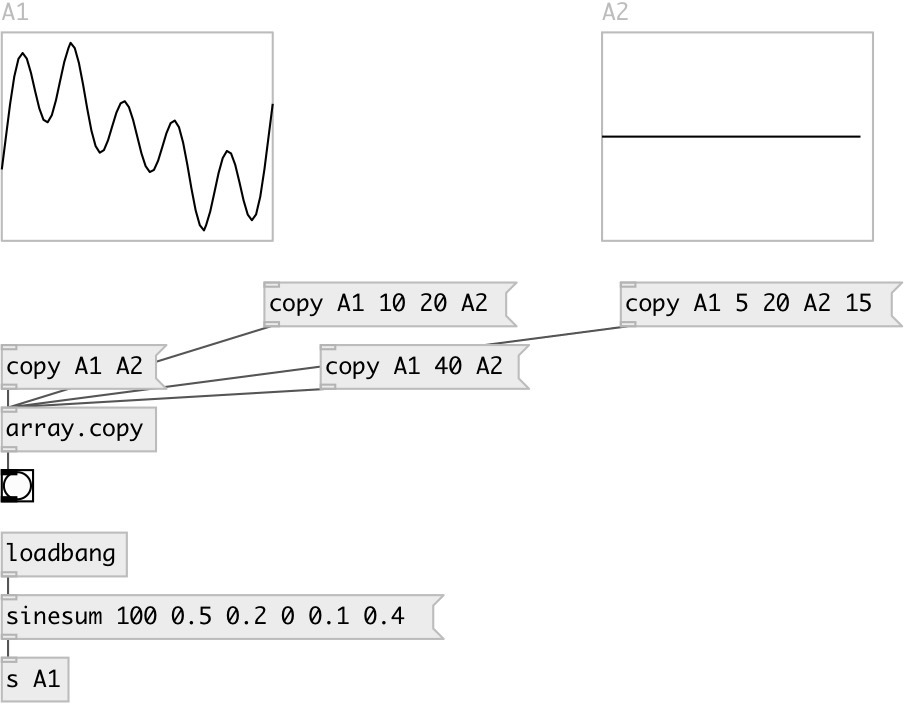

[index](index.html) :: [array](category_array.html)
---

# array.copy

###### copy samples from one array to another

*доступно с версии:* 0.3

---

## методы:

* **copy**
copy whole array content 
  __параметры:__
  - **SRC** name of source array 
    тип: symbol  
    обязательно: True  

  - **DEST** name of destination array 
    тип: symbol  
    обязательно: True  

* **copy**
copy array content from specified position till end 
  __параметры:__
  - **SRC** name of source array 
    тип: symbol  
    обязательно: True  

  - **FROM** source start position 
    тип: int  
    обязательно: True  

  - **DEST** name of destination array 
    тип: symbol  
    обязательно: True  

* **copy**
copy array content from specified range 
  __параметры:__
  - **SRC** name of source array 
    тип: symbol  
    обязательно: True  

  - **FROM** source start range 
    тип: int  
    обязательно: True  

  - **TO** source end range 
    тип: int  
    обязательно: True  

  - **DEST** name of destination array 
    тип: symbol  
    обязательно: True  

* **copy**
copy array content from specified range and to specified destination position 
  __параметры:__
  - **SRC** name of source array 
    тип: symbol  
    обязательно: True  

  - **FROM** source start range 
    тип: int  
    обязательно: True  

  - **TO** source end range 
    тип: int  
    обязательно: True  

  - **DEST** name of destination array 
    тип: symbol  
    обязательно: True  

  - **DEST_FROM** destination start position 
    тип: int  
    обязательно: True  

## свойства:

* **@resize** 
Запросить/установить resize of destination array on overflow 
_тип:_ bool 
_по умолчанию:_ 0 

## входы:

* FROM, TO - copy data from one array to another 
_тип:_ control

## выходы:

* bang on finish 
_тип:_ control

## ключевые слова:

[array](keywords/array.html)
[copy](keywords/copy.html)

**Смотрите также:**
[\[array.each\]](array.each.html)

**Авторы:** Serge Poltavsky

**Лицензия:** GPL3 or later

