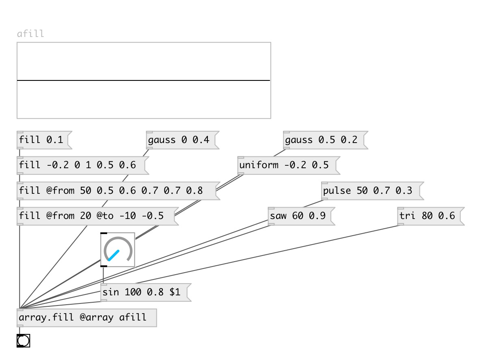

[index](index.html) :: [array](category_array.html)
---

# array.fill

###### fill array with single value or pattern

*доступно с версии:* 0.3

---

## методы:

* **fill**
fill all array with specified value or pattern 
  __параметры:__
  - **[@from]** fill range begin index. If not specified set to 0. 
    тип: int  

  - **[@to]** fill range end index. Can be negative - to address from array end. For example: -1 means till last element (not including). If not specified set to array length. 
    тип: int  

  - **VAL1** value 1 
    тип: float  
    обязательно: True  

  - **[VAL...]** other values.. 
    тип: float  

* **sin**
fill all array with sine wave 
  __параметры:__
  - **T** wave period. Should be &gt;0 
    тип: float  
    единица: samp  
    обязательно: True  

  - **[A=1]** amplitude 
    тип: float  

  - **[PHASE=0]** phase in 0...1 range 
    тип: float  

* **gauss**
fill all array with random value with normal (gauss) distribution 
  __параметры:__
  - **[MEAN=0]** mean value 
    тип: float  

  - **[SIGMA=1]** standard deviation 
    тип: float  

* **uniform**
fill all array with random value with uniform distribution 
  __параметры:__
  - **[A=0]** min value 
    тип: float  

  - **[B=1]** max value 
    тип: float  

* **pulse**
fill all array with pulse wave 
  __параметры:__
  - **T** wave period 
    тип: float  
    единица: samp  
    обязательно: True  

  - **[A=1]** wave amplitude 
    тип: float  

  - **[D=0.5]** duty cycle 
    тип: float  

* **tri**
fill all array with triangle wave 
  __параметры:__
  - **T** wave period 
    тип: float  
    единица: samp  
    обязательно: True  

  - **[AMP=1]** wave amplitude 
    тип: float  

* **saw**
fill all array with saw wave 
  __параметры:__
  - **T** wave period 
    тип: float  
    единица: samp  
    обязательно: True  

  - **[A=1]** wave amplitude 
    тип: float  

## свойства:

* **@array** 
Получить/установить array name 
_тип:_ symbol 

* **@redraw** 
Получить/установить redraw after array change 
_тип:_ int 
_варианты:_ 1, 0 
_по умолчанию:_ 1 

## входы:

* change array name 
_тип:_ control

## выходы:

* bang on finish 
_тип:_ control

## ключевые слова:

[array](keywords/array.html)
[fill](keywords/fill.html)

**Смотрите также:**
[\[array.each\]](array.each.html)

**Авторы:** Serge Poltavsky

**Лицензия:** GPL3 or later

