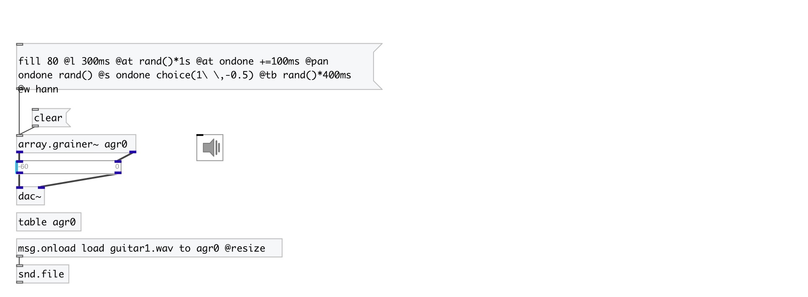

[index](index.html) :: [array](category_array.html)
---

# array.grainer~

###### array granulator

*доступно с версии:* 0.9.2

---

## информация
Grain properties: @at - grain position in source array (in samples) @l - grain length (in samples) @amp - grain amplitude in 0..256 range @s - grain speed in -10..10 range @p - grain pan in 0..1 range @w - grain window: rect, tri or hann @tb - time before grain start (in samples) @ta - time after grain done (in samples) @r - grain number of repeats (-1: infinite) @tag - grain tag

## аргументы:

* **ARRAY**
array name 
_тип:_ symbol 

## методы:

* **align**
align grain(s) to onset 
  __параметры:__
  - **[SUBJ]** if &#39;*&#39; or omitted: align all grains, if &#39;.&#39;: align finished grains only, if float: align grain with corresponding #id, if symbol: align grains with corresponding tag 
    тип: atom  

* **append**
append several grains 
  __параметры:__
  - **N** number of grains 
    тип: int  
    обязательно: True  

  - **PROPS** grain properties 
    тип: list  
    обязательно: True  

* **clear**
remove grain(s) 
  __параметры:__
  - **[SUBJ]** if &#39;*&#39; or omitted: remove all grains, if &#39;.&#39;: remove finished grains only, if float: remove grain with corresponding #id, if symbol: remove grains with corresponding tag 
    тип: atom  

* **defer**
defer method call until grains will finish 
  __параметры:__
  - **[N]** number of finished grains to wait before calling. If not specified, treat as 1. 
    тип: int  

  - **METHOD** method name 
    тип: symbol  
    обязательно: True  

  - **[ARGS]** method arguments 
    тип: list  

* **fill**
fill with grains (remove all existing grains before) 
  __параметры:__
  - **N** number of grains 
    тип: int  
    обязательно: True  

  - **PROPS** grain properties 
    тип: list  
    обязательно: True  

* **grain**
create single grain 
  __параметры:__
  - **PROPS** grain properties 
    тип: list  
    обязательно: True  

* **onsets**
analyze source array for onsets 
  __параметры:__
  - **[METHOD=default]** onset detection method 
    тип: symbol  

  - **[SPACE=64]** minimal space between onsets 
    тип: float  
    единица: ms  

  - **[SILENCE=-40]** silence level 
    тип: float  
    единица: db  

* **pause**
pause (resume) grain(s) 
  __параметры:__
  - **SUBJ** if &#39;*&#39;: pause all grains, if float: pause grain with corresponding #id, if symbol: pause grains with matched tag 
    тип: atom  
    обязательно: True  

  - **[STATE]** on/off value 
    тип: int  

* **permutate**
permutate grain positions (@ta and @tb) values 
  __параметры:__
  - **[N]** number of permutations. If N&gt;0 results N-th next permutation, N&lt;0 - N-th previous permutation 
    тип: int  

  - **[TAG]** if &#39;*&#39; or omitted: reverse positions of all grains, if &#39;.&#39;: reverse positions of finished grains only, otherwise reverse grains with corresponding tag 
    тип: symbol  

* **reverse**
reverse grain positions (@ta and @tb) values 
  __параметры:__
  - **[TAG]** if &#39;*&#39; or omitted: reverse positions of all grains, if &#39;.&#39;: reverse positions of finished grains only, otherwise reverse grains with corresponding tag 
    тип: symbol  

* **set**
set grain(s) properties 
  __параметры:__
  - **SUBJ** if &#39;*&#39;: set for all grains, if float: set for grain with specified #id, if symbol: set for grains with specified tag 
    тип: atom  
    обязательно: True  

  - **PROPS** grain properties 
    тип: list  
    обязательно: True  

* **shuffle**
shuffle grain positions (@ta and @tb) values 
  __параметры:__
  - **[TAG]** if &#39;*&#39; or omitted: shuffle all grains, if &#39;.&#39;: shuffle finished grains only, otherwise shuffle grains with corresponding tag 
    тип: symbol  

* **slice**
slice specified duration to specified number of grains and add them 
  __параметры:__
  - **N** desired number of grains 
    тип: int  
    обязательно: True  

  - **[DUR]** duration to slice. Positive time value expected, for example: 100ms, 1.02s, 400samp etc. Float value treat as millisecond. If not specified - use the whole source array duration 
    тип: atom  

  - **[GRAIN]** properties of sliced grains 
    тип: list  

* **spread**
uniformly arrange grains to fill specified time space 
  __параметры:__
  - **[DUR]** time space. Positive time values are expected, for example: 100ms, 1.02s, 400samp etc. Float value treat as millisecond. If not specified - use the whole source array duration 
    тип: atom  

  - **[TAG]** if &#39;*&#39; or omitted: spread all grains, if &#39;.&#39;: spread finished grains only, otherwise spread grains with corresponding tag 
    тип: symbol  

## свойства:

* **@array** 
Запросить/установить array name 
_тип:_ symbol 

* **@sync** 
Запросить/установить grain sync mode. If &#39;none&#39;: start grains right after they are finished, if
&#39;int&#39;: start grains after specified interval (@tsync). 
_тип:_ symbol 
_варианты:_ none, int, ext 
_по умолчанию:_ none 

* **@tsync** 
Запросить/установить grain sync interval 
_тип:_ float 
_единица:_ ms 
_минимальное значение:_ 1 
_по умолчанию:_ 50 

* **@prob** 
Запросить/установить grain start probability in internal or external sync mode. (&#39;int&#39; or &#39;ext&#39;) 
_тип:_ float 
_диапазон:_ 0..1 
_по умолчанию:_ 1 

## входы:

* control inlet 
_тип:_ control

## выходы:

* left output 
_тип:_ audio
* right output 
_тип:_ audio

## ключевые слова:

[array](keywords/array.html)
[grain](keywords/grain.html)
[particle](keywords/particle.html)
[granular](keywords/granular.html)

**Смотрите также:**
[\[array.each\]](array.each.html)

**Авторы:** Serge Poltavsky

**Лицензия:** GPL3 or later

