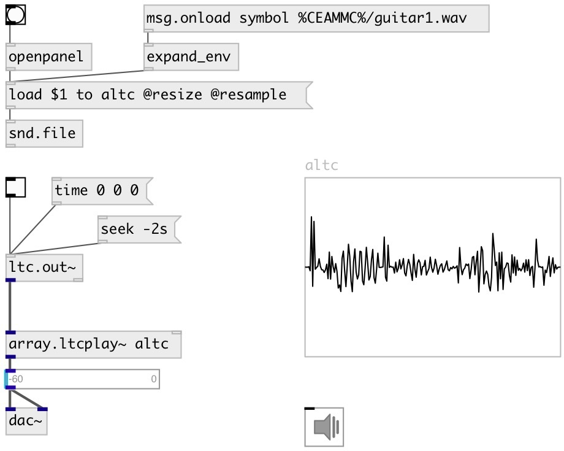

[index](index.html) :: [array](category_array.html)
---

# array.ltcplay~

###### array player controlled by LTC

*доступно с версии:* 0.9.7

---

## аргументы:

* **ARRAY**
array name 
_тип:_ symbol 

## свойства:

* **@array** 
Запросить/установить array name 
_тип:_ symbol 

* **@fps** 
Запросить/установить expected LTC stream framerate 
_тип:_ atom 
_варианты:_ auto, 24, 25, 29.97, 30 
_по умолчанию:_ auto 

## входы:

* LTC input signal 
_тип:_ audio
* set source array 
_тип:_ control

## выходы:

* output 
_тип:_ audio

## ключевые слова:

[array](keywords/array.html)
[ltc](keywords/ltc.html)
[play](keywords/play.html)

**Авторы:** Serge Poltavsky

**Лицензия:** GPL3 or later

