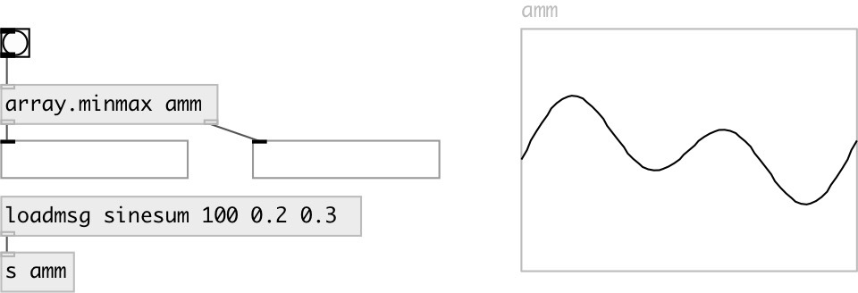

[index](index.html) :: [array](category_array.html)
---

# array.minmax

###### find array min and max element value

*доступно с версии:* 0.3

---

## аргументы:

* **NAME**
array name 
_тип:_ symbol 

## свойства:

* **@array** 
Получить/установить array name 
_тип:_ symbol 

## входы:

* perform search in current array 
_тип:_ control

## выходы:

* list with two elements: minimal and maximum value 
_тип:_ control
* indexes of found values 
_тип:_ control

## ключевые слова:

[array](keywords/array.html)
[minmax](keywords/minmax.html)

**Авторы:** Serge Poltavsky

**Лицензия:** GPL3 or later

