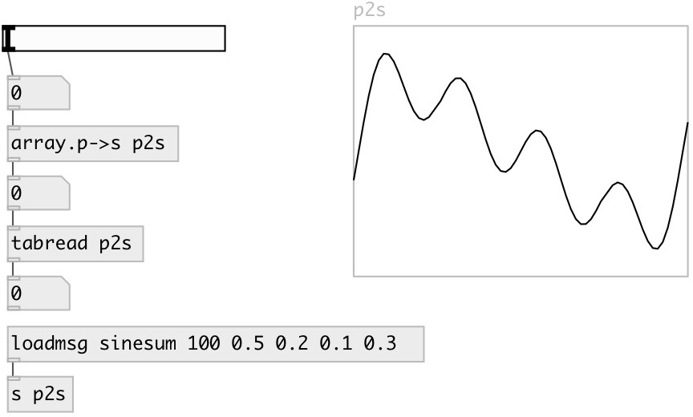

[index](index.html) :: [conv](category_conv.html)
---

# array.p2s

###### convert array phase [0..1] to sample position

*доступно с версии:* 0.2

---

## информация
this object allows to get relative access to array

## аргументы:

* **NAME**
array name 
_тип:_ symbol 

## свойства:

* **@array** 
Получить/установить array name 
_тип:_ symbol 

## входы:

* value between 0 and 1, where 0 maps to begin of array, 1 - to end 
_тип:_ control

## выходы:

* sample number 
_тип:_ control

## ключевые слова:

[array](keywords/array.html)
[phase](keywords/phase.html)
[sample](keywords/sample.html)

**Смотрите также:**
[\[array.s2p\]](array.s2p.html)

**Авторы:** Serge Poltavsky

**Лицензия:** GPL3 or later

