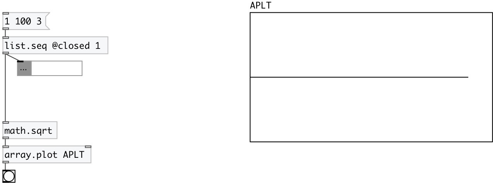

[index](index.html) :: [array](category_array.html)
---

# array.plot

###### array data plotter

*доступно с версии:* 0.9.2

---

## аргументы:

* **ARRAY**
array name 
_тип:_ symbol 

* **YMIN**
minimal y-axis value 
_тип:_ float 

* **YMAX**
maximum y-axis value 
_тип:_ float 

## свойства:

* **@array** 
Запросить/установить array name 
_тип:_ symbol 

* **@ymin** 
Запросить/установить minimal y-axis value 
_тип:_ float 
_диапазон:_ -2048..2048 
_по умолчанию:_ -1 

* **@ymax** 
Запросить/установить maximum y-axis value 
_тип:_ float 
_диапазон:_ -2048..2048 
_по умолчанию:_ 1 

* **@yauto** 
Запросить/установить calculate y-axis range automatically 
_тип:_ bool 
_по умолчанию:_ 1 

* **@nan** 
Запросить/установить value to replace nan on plot 
_тип:_ float 
_по умолчанию:_ +inf 

## входы:

* single input sample 
_тип:_ control
* plot all samples fitted to specified array 
_тип:_ control

## выходы:

* bang on done 
_тип:_ control

## ключевые слова:

[array](keywords/array.html)
[plot](keywords/plot.html)

**Смотрите также:**
[\[array.plot~\]](array.plot~.html)

**Авторы:** Serge Poltavsky

**Лицензия:** GPL3 or later

