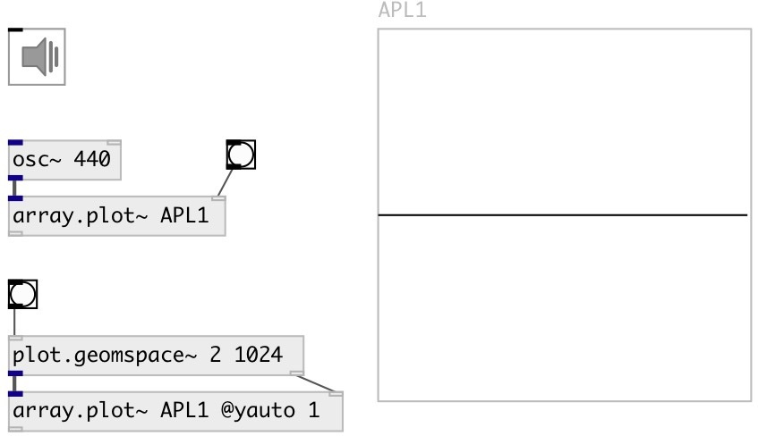

[index](index.html) :: [array](category_array.html)
---

# array.plot~

###### plot signal on specified array

*доступно с версии:* 0.9

---

## аргументы:

* **ARRAY**
array name 
_тип:_ symbol 

* **YMIN**
minimal y-axis value 
_тип:_ float 

* **YMAX**
maximum y-axis value 
_тип:_ float 

## свойства:

* **@array** 
Запросить/установить array name 
_тип:_ symbol 

* **@ymin** 
Запросить/установить minimal y-axis value 
_тип:_ float 
_диапазон:_ -1024..1024 
_по умолчанию:_ -1 

* **@ymax** 
Запросить/установить minimal y-axis value 
_тип:_ float 
_диапазон:_ -1024..1024 
_по умолчанию:_ 1 

* **@yauto** 
Запросить/установить calculate y-axis range automatically 
_тип:_ bool 
_по умолчанию:_ 0 

## входы:

* input signal 
_тип:_ audio
* plot all samples fitted to specified array 
_тип:_ control

## ключевые слова:

[array](keywords/array.html)
[plot](keywords/plot.html)

**Смотрите также:**
[\[ui.plot~\]](ui.plot~.html)
[\[array.plot\]](array.plot.html)

**Авторы:** Serge Poltavsky

**Лицензия:** GPL3 or later

