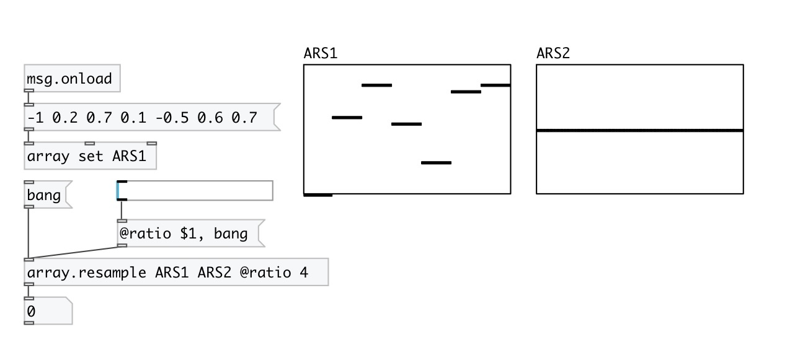

[index](index.html) :: [array](category_array.html)
---

# array.resample

###### array resampler

*доступно с версии:* 0.9

---

## аргументы:

* **SRC**
source array 
_тип:_ symbol 

* **DEST**
destination array 
_тип:_ symbol 

## свойства:

* **@src** 
Получить/установить source array 
_тип:_ symbol 

* **@dest** 
Получить/установить destination array 
_тип:_ symbol 

* **@ratio** 
Получить/установить resample ratio (src/dest) 
_тип:_ float 
_минимальное значение:_ 0 
_по умолчанию:_ 0 

* **@quality** 
Получить/установить resample quality 
_тип:_ symbol 
_варианты:_ high, fast, low, medium, best 
_по умолчанию:_ high 

* **@high** 
Получить/установить alias to @quality high 
_тип:_ alias 

* **@fast** 
Получить/установить alias to @quality fast 
_тип:_ alias 

* **@low** 
Получить/установить alias to @quality low 
_тип:_ alias 

* **@medium** 
Получить/установить alias to @quality medium 
_тип:_ alias 

* **@best** 
Получить/установить alias to @quality best 
_тип:_ alias 

## входы:

* starts resampling 
_тип:_ control

## выходы:

* number of samples written 
_тип:_ control

## ключевые слова:

[array](keywords/array.html)
[resample](keywords/resample.html)

**Авторы:** Serge Poltavsky

**Лицензия:** GPL3 or later

