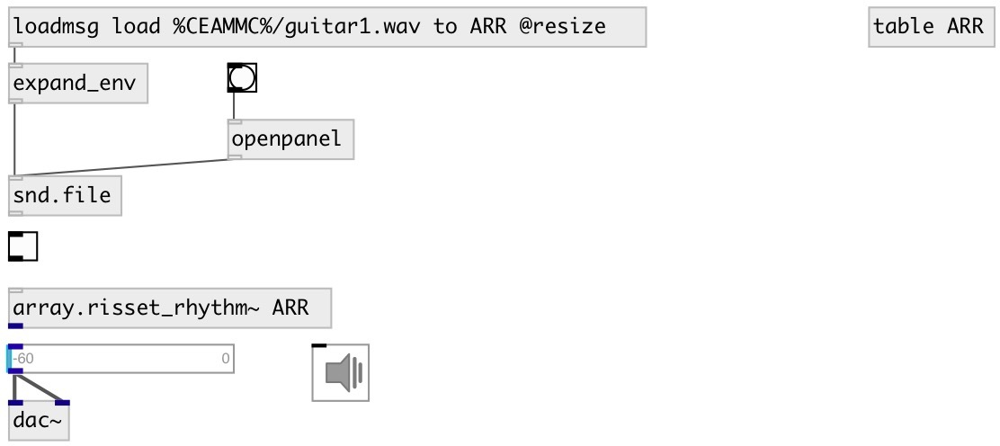

[index](index.html) :: [array](category_array.html)
---

# array.risset_rhythm~

###### Risset Rhythm: accelerando or ritardando

*доступно с версии:* 0.9.5

---

## информация
not finished yet

## входы:

* change array name 
_тип:_ control

## выходы:

* output signal 
_тип:_ control

## ключевые слова:

[array](keywords/array.html)
[risset](keywords/risset.html)
[rhythm](keywords/rhythm.html)

**Авторы:** Serge Poltavsky

**Лицензия:** GPL3 or later

