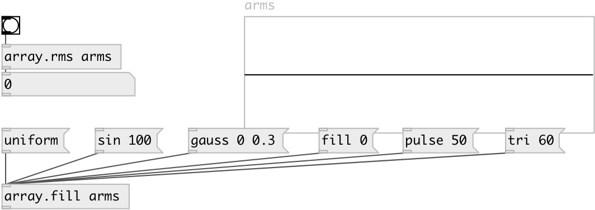

[index](index.html) :: [array](category_array.html)
---

# array.rms

###### calculates root mean square value for array

*доступно с версии:* 0.7.1

---

## аргументы:

* **NAME**
array name 
_тип:_ symbol 

## свойства:

* **@array** 
Получить/установить array name 
_тип:_ symbol 

## входы:

* calculates and outputs RMS value 
_тип:_ control

## выходы:

* RMS value 
_тип:_ control

## ключевые слова:

[array](keywords/array.html)
[mean](keywords/mean.html)
[rms](keywords/rms.html)
[square](keywords/square.html)

**Смотрите также:**
[\[array.mean\]](array.mean.html)
[\[array.sum2\]](array.sum2.html)

**Авторы:** Serge Poltavsky

**Лицензия:** GPL3 or later

