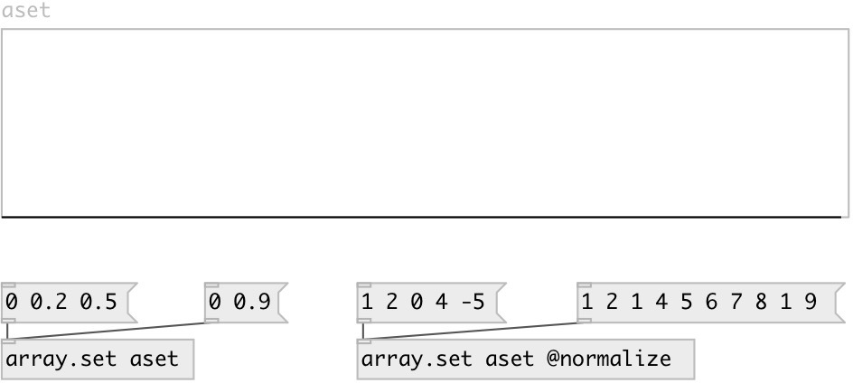

[index](index.html) :: [array](category_array.html)
---

# array.set

###### set array content from list

*доступно с версии:* 0.4

---

## аргументы:

* **ARRAY**
array name 
_тип:_ symbol 

## свойства:

* **@array** 
Запросить/установить array name 
_тип:_ symbol 

* **@normalize** (initonly)
Запросить/установить scale input values to fit them in [0, 1] range 
_тип:_ flag 
_по умолчанию:_ 0 

* **@redraw** 
Запросить/установить redraw array view 
_тип:_ bool 
_по умолчанию:_ 1 

## входы:

* resizes array and sets its content 
_тип:_ control

## ключевые слова:

[array](keywords/array.html)
[set](keywords/set.html)

**Смотрите также:**
[\[array.each\]](array.each.html)

**Авторы:** Serge Poltavsky

**Лицензия:** GPL3 or later

