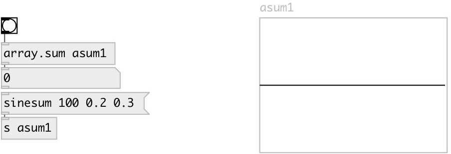

[index](index.html) :: [array](category_array.html)
---

# array.sum

###### calculates sum of array elements

*доступно с версии:* 0.8

---

## аргументы:

* **NAME**
array name 
_тип:_ symbol 

## свойства:

* **@array** 
Получить/установить array name 
_тип:_ symbol 

## входы:

* calculates and outputs the sum 
_тип:_ control

## выходы:

* sum of array values 
_тип:_ control

## ключевые слова:

[array](keywords/array.html)
[sum](keywords/sum.html)

**Смотрите также:**
[\[array.sum2\]](array.sum2.html)

**Авторы:** Serge Poltavsky

**Лицензия:** GPL3 or later

