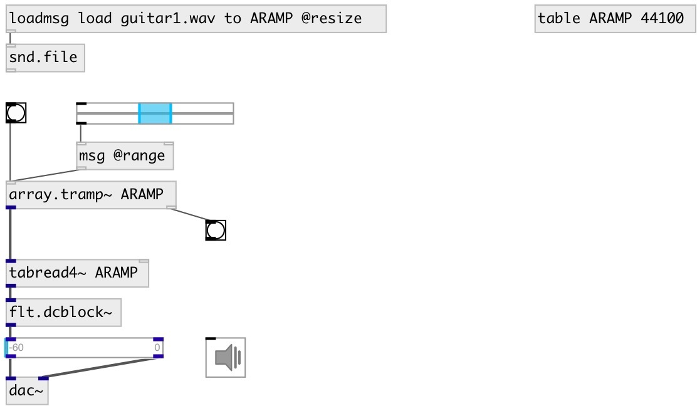

[index](index.html) :: [array](category_array.html)
---

# array.tramp~

###### triggered ramp generator for array

*доступно с версии:* 0.9.7

---

## аргументы:

* **ARRAY**
array name 
_тип:_ symbol 

* **SPEED**
playing speed 
_тип:_ float 

## свойства:

* **@array** 
Запросить/установить array name 
_тип:_ symbol 

* **@speed** 
Запросить/установить ramp speed 
_тип:_ float 
_по умолчанию:_ 1 

* **@from** 
Запросить/установить normalized to [0-1] range ramp start 
_тип:_ float 
_диапазон:_ 0..1 
_по умолчанию:_ 0 

* **@to** 
Запросить/установить normalized to [0-1] range ramp end 
_тип:_ float 
_диапазон:_ 0..1 
_по умолчанию:_ 1 

* **@range** 
Запросить/установить ramp range 
_тип:_ list 
_по умолчанию:_ 0 1 

## входы:

* start ramp for array 
_тип:_ control

## выходы:

* ramp signal 
_тип:_ audio
* bang on done 
_тип:_ control

## ключевые слова:

[array](keywords/array.html)
[ramp](keywords/ramp.html)
[trigger](keywords/trigger.html)

**Авторы:** Serge Poltavsky

**Лицензия:** GPL3 or later

