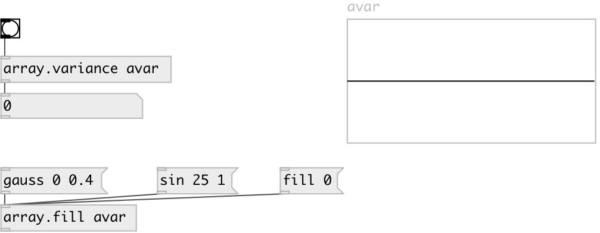

[index](index.html) :: [array](category_array.html)
---

# array.variance

###### calculates variance of array values

*доступно с версии:* 0.7.1

---

## аргументы:

* **ARRAY**
array name 
_тип:_ symbol 

## свойства:

* **@array** 
Запросить/установить array name 
_тип:_ symbol 

## входы:

* calculates and outputs variance 
_тип:_ control

## выходы:

* variance 
_тип:_ control

## ключевые слова:

[array](keywords/array.html)
[deviation](keywords/deviation.html)
[variance](keywords/variance.html)

**Смотрите также:**
[\[array.stddev\]](array.stddev.html)

**Авторы:** Serge Poltavsky

**Лицензия:** GPL3 or later

