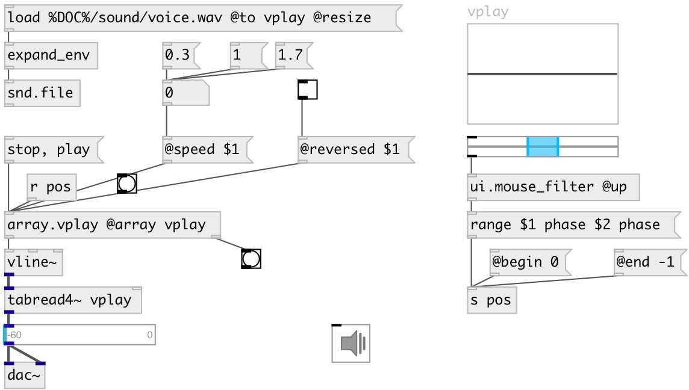

[index](index.html) :: [array](category_array.html)
---

# array.vplay

###### simple array player for using with vline~

*доступно с версии:* 0.5

---

## аргументы:

* **ARRAY**
array name 
_тип:_ symbol 

## методы:

* **play**
start playing 

* **range**
set play range. 
  __параметры:__
  - **VALUE** start value. Negative values (offset from end) are supported for ms, sec and sample units. *-1 sample* means last sample. 
    тип: float  
    обязательно: True  

  - **UNIT** value unit 
    тип: symbol  
    обязательно: True  

  - **[VALUE]** end value 
    тип: float  

  - **UNIT** value unit 
    тип: symbol  
    обязательно: True  

* **stop**
stop playing 

## свойства:

* **@array** 
Запросить/установить array name 
_тип:_ symbol 

* **@state** (readonly)
Запросить player state 
_тип:_ symbol 
_варианты:_ play, stop 
_по умолчанию:_ stop 

* **@speed** 
Запросить/установить play speed 
_тип:_ float 
_минимальное значение:_ 0.1 
_по умолчанию:_ 1 

* **@begin** 
Запросить/установить begin position in samples 
_тип:_ int 
_единица:_ samp 
_по умолчанию:_ 0 

* **@end** 
Запросить/установить end position in samples 
_тип:_ int 
_единица:_ samp 
_по умолчанию:_ -1 

* **@abs_begin** (readonly)
Запросить absolute start position in samples 
_тип:_ int 
_единица:_ samp 
_по умолчанию:_ 0 

* **@abs_end** (readonly)
Запросить absolute stop position in samples 
_тип:_ int 
_единица:_ samp 
_по умолчанию:_ 0 

* **@reversed** 
Запросить/установить playing backwards (if set to 1) 
_тип:_ bool 
_по умолчанию:_ 0 

## входы:

* start playing from the beginning 
_тип:_ control

## выходы:

* message to vline~ object 
_тип:_ control
* bang after playing finished 
_тип:_ control

## ключевые слова:

[array](keywords/array.html)
[play](keywords/play.html)
[vline](keywords/vline.html)

**Смотрите также:**
[\[list.each\]](list.each.html)

**Авторы:** Serge Poltavsky

**Лицензия:** GPL3 or later

