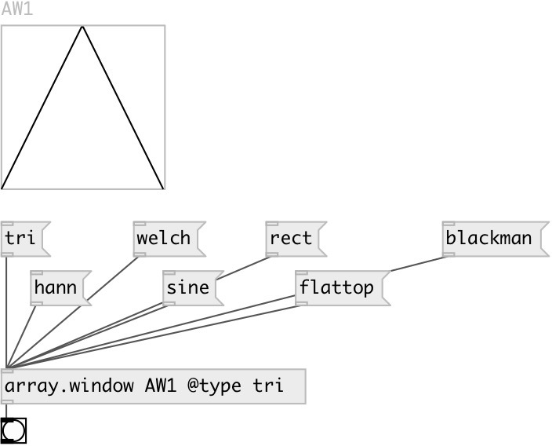

[index](index.html) :: [array](category_array.html)
---

# array.window

###### fill array with window

*доступно с версии:* 0.7

---

## аргументы:

* **ARRAY**
array name 
_тип:_ symbol 

## методы:

* **blackman**
generate blackman window 

* **blackman-harris**
generate blackman-harris window 

* **fit**
fit array y-bounds to 0..1 range 

* **flattop**
generate flattop window 

* **gauss**
generate gauss window 

* **hamming**
generate hamming window 

* **hann**
generate hann window 

* **nuttall**
generate nuttall window 

* **rect**
generate rectangular window 

* **resize**
resize specified array to given size 
  __параметры:__
  - **[N]** new size 
    тип: int  

* **sine**
generate sine window 

* **tri**
generate triangular window 

* **welch**
generate welch window 

## свойства:

* **@array** 
Запросить/установить array name 
_тип:_ symbol 

* **@redraw** 
Запросить/установить redraw after array change 
_тип:_ bool 
_по умолчанию:_ 1 

* **@type** 
Запросить/установить window type 
_тип:_ symbol 
_варианты:_ tri, welch, hann, sine, rect, hamming, blackman, nuttall, blackman-harris, flattop, gauss 
_по умолчанию:_ hann 

## входы:

* fill array with window 
_тип:_ control

## выходы:

* bang on finish 
_тип:_ control

## ключевые слова:

[array](keywords/array.html)
[window](keywords/window.html)

**Смотрите также:**
[\[window\]](window.html)

**Авторы:** Serge Poltavsky

**Лицензия:** GPL3 or later

