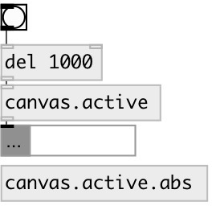

[index](index.html) :: [patch](category_patch.html)
---

# canvas.active

###### checks if canvas window is on top and active

*доступно с версии:* 0.9.6

---

## свойства:

* **@abs** 
Запросить/установить use canvas for abstractions 
_тип:_ bool 
_по умолчанию:_ 0 

## входы:

* output canvas active state 
_тип:_ control

## выходы:

* int: 1 or 0 
_тип:_ control

## ключевые слова:

[canvas](keywords/canvas.html)

**Смотрите также:**
[\[patch.args\]](patch.args.html)
[\[canvas.top\]](canvas.top.html)

**Авторы:** Serge Poltavsky

**Лицензия:** GPL3 or later

