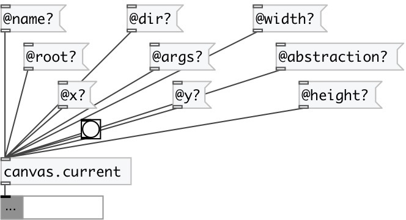

[index](index.html) :: [patch](category_patch.html)
---

# canvas.current

###### verbose information about current canvas

*доступно с версии:* 0.4

---

## свойства:

* **@name** (readonly)
Запросить canvas name 
_тип:_ symbol 
_по умолчанию:_ test_canvas 

* **@dir** (readonly)
Запросить canvas directory (only if top level or abstraction) 
_тип:_ symbol 
_по умолчанию:_ / 

* **@args** (readonly)
Запросить canvas creation arguments 
_тип:_ list 

* **@root** (readonly)
Запросить 1 if canvas is top-level (window) 
_тип:_ bool 
_по умолчанию:_ 1 

* **@abstraction** (readonly)
Запросить 1 if canvas is abstraction 
_тип:_ bool 
_по умолчанию:_ 1 

* **@size** (readonly)
Запросить canvas dimensions. If root canvas (window) return window size, if subpatch
return Graph on Parent size 
_тип:_ list 
_по умолчанию:_ 600 400 

* **@font** (readonly)
Запросить canvas font size 
_тип:_ int 
_по умолчанию:_ 10 

* **@paths** (readonly)
Запросить canvas search paths 
_тип:_ list 

* **@width** (readonly)
Запросить canvas width (window or GOP) 
_тип:_ int 
_по умолчанию:_ 600 

* **@height** (readonly)
Запросить canvas height (window or GOP) 
_тип:_ int 
_по умолчанию:_ 400 

* **@x** (readonly)
Запросить canvas x-pos (window or GOP) 
_тип:_ int 
_по умолчанию:_ 0 

* **@y** (readonly)
Запросить canvas y-pos (window or GOP) 
_тип:_ int 
_по умолчанию:_ 0 

## входы:

* property request 
_тип:_ control

## выходы:

* dict or property output 
_тип:_ control

## ключевые слова:

[canvas](keywords/canvas.html)

**Смотрите также:**
[\[patch.args\]](patch.args.html)
[\[canvas.top\]](canvas.top.html)

**Авторы:** Serge Poltavsky

**Лицензия:** GPL3 or later

