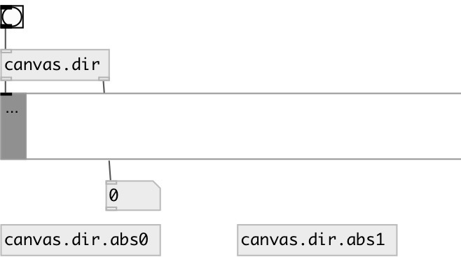

[index](index.html) :: [patch](category_patch.html)
---

# canvas.dir

###### current canvas directory and nesting level

*доступно с версии:* 0.8

---

## свойства:

* **@abs** 
Запросить/установить abstraction mode. If true: output topmost parent canvas directory if this
object was not created inside an abstraction, and abstraction directory if it
was. If false: output topmost parent canvas directory even this object was
create inside the abstrction subpatch. 
_тип:_ bool 
_по умолчанию:_ 1 

## входы:

* output current canvas directory 
_тип:_ control

## выходы:

* symbol: current canvas directory 
_тип:_ control
* int: nesting level 
_тип:_ control

## ключевые слова:

[canvas](keywords/canvas.html)
[directory](keywords/directory.html)

**Смотрите также:**
[\[canvas.name\]](canvas.name.html)
[\[canvas.path\]](canvas.path.html)

**Авторы:** Serge Poltavsky

**Лицензия:** GPL3 or later

