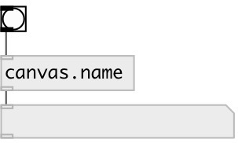

[index](index.html) :: [patch](category_patch.html)
---

# canvas.name

###### current canvas name

*доступно с версии:* 0.8

---

## входы:

* output current canvas name 
_тип:_ control

## выходы:

* current canvas name 
_тип:_ control

## ключевые слова:

[canvas](keywords/canvas.html)
[name](keywords/name.html)

**Смотрите также:**
[\[canvas.current\]](canvas.current.html)

**Авторы:** Serge Poltavsky

**Лицензия:** GPL3 or later

