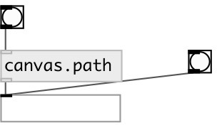

[index](index.html) :: [patch](category_patch.html)
---

# canvas.path

###### current canvas fullpath

*доступно с версии:* 0.8

---

## входы:

* output current canvas fullpath 
_тип:_ control

## выходы:

* current canvas fullpath as symbol 
_тип:_ control

## ключевые слова:

[canvas](keywords/canvas.html)
[path](keywords/path.html)

**Смотрите также:**
[\[canvas.name\]](canvas.name.html)
[\[canvas.dir\]](canvas.dir.html)

**Авторы:** Serge Poltavsky

**Лицензия:** GPL3 or later

