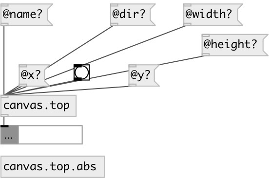

[index](index.html) :: [patch](category_patch.html)
---

# canvas.top

###### verbose information about top-level canvas

*доступно с версии:* 0.4

---

## методы:

* **postscript**
save patch to postscript 
  __параметры:__
  - **[FNAME]** file. If not specified patch name used with .ps extension 
    тип: symbol  

## свойства:

* **@name** (readonly)
Запросить canvas name 
_тип:_ symbol 
_по умолчанию:_ test_canvas 

* **@dir** (readonly)
Запросить canvas directory 
_тип:_ symbol 
_по умолчанию:_ / 

* **@size** (readonly)
Запросить window size 
_тип:_ list 
_по умолчанию:_ 600 400 

* **@width** (readonly)
Запросить window width 
_тип:_ int 
_по умолчанию:_ 600 

* **@height** (readonly)
Запросить window height 
_тип:_ int 
_по умолчанию:_ 400 

* **@font** (readonly)
Запросить window font 
_тип:_ int 
_по умолчанию:_ 10 

* **@paths** (readonly)
Запросить search paths 
_тип:_ list 

* **@x** (readonly)
Запросить window x-pos 
_тип:_ int 
_по умолчанию:_ 0 

* **@y** (readonly)
Запросить window y-pos 
_тип:_ int 
_по умолчанию:_ 0 

* **@abs** 
Запросить/установить if false: using toplevel canvas, if true: using abstraction canvas 
_тип:_ bool 
_по умолчанию:_ 1 

## входы:

* property request 
_тип:_ control

## выходы:

* dict/property output 
_тип:_ control

## ключевые слова:

[canvas](keywords/canvas.html)

**Смотрите также:**
[\[patch.args\]](patch.args.html)
[\[canvas.current\]](canvas.current.html)

**Авторы:** Serge Poltavsky

**Лицензия:** GPL3 or later

