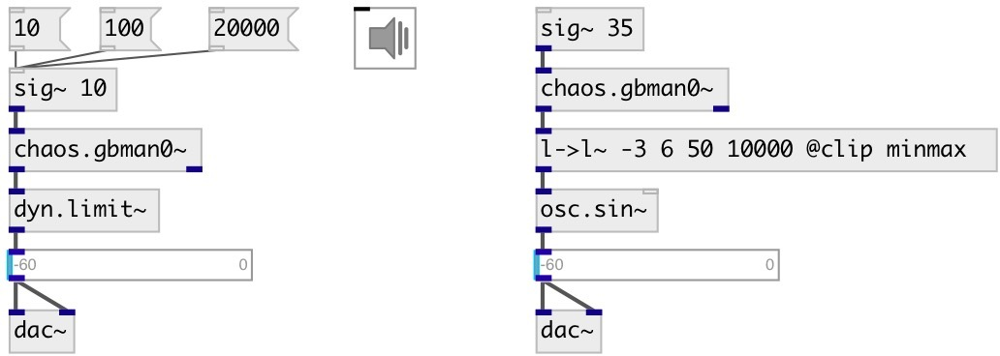

[index](index.html) :: [chaos](category_chaos.html)
---

# chaos.gbman0~

###### Gingerbreadman map chaotic generator

*доступно с версии:* 0.9

---

## информация
A non-interpolating sound generator based on the difference equations: x(n+1) = 1 - y(n) + |x(n)| y(n+1) = x(n)

## аргументы:

* **X**
initial x value, default 1.2 
_тип:_ float 

* **Y**
initial y value, default 2.1 
_тип:_ float 

## входы:

* generation frequency, minimal value 0.001Hz 
_тип:_ audio

## выходы:

* outputs x value 
_тип:_ audio
* outputs y value 
_тип:_ audio

## ключевые слова:

[chaos](keywords/chaos.html)

**Смотрите также:**
[\[chaos.gbman0\]](chaos.gbman0.html)

**Авторы:** Serge Poltavski

**Лицензия:** GPL3 or later

