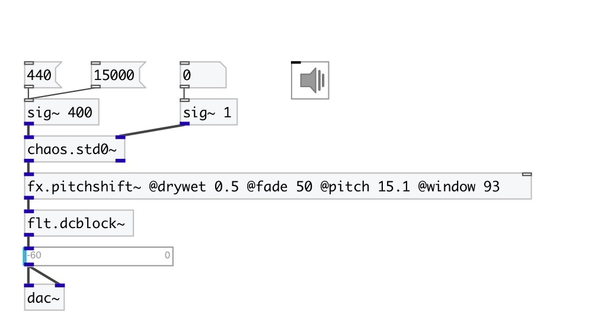

[index](index.html) :: [chaos](category_chaos.html)
---

# chaos.std0~

###### Standard map chaotic generator

*доступно с версии:* 0.9

---

## информация
A non-interpolating generator based on the difference equations: y(n+1) = (y(n) + k * sin(x(n))) % 2pi x(n+1) = (x(n) + y(n+1)) % 2pi The properties of chaos of the standard map were established by Boris Chirikov in 1969

## аргументы:

* **X**
initial x value, default 0.5 
_тип:_ float 

* **Y**
initial y value, default 0 
_тип:_ float 

## входы:

* generation frequency, minimal value 0.001Hz 
_тип:_ audio
* k-value 
_тип:_ audio

## выходы:

* outputs x-value mapped to [-1..1] range 
_тип:_ audio
* outputs y-value mapped to [-1..1] range 
_тип:_ audio

## ключевые слова:

[chaos](keywords/chaos.html)
[standard](keywords/standard.html)
[map](keywords/map.html)

**Смотрите также:**
[\[chaos.std0\]](chaos.std0.html)

**Авторы:** Serge Poltavsky

**Лицензия:** GPL3 or later

