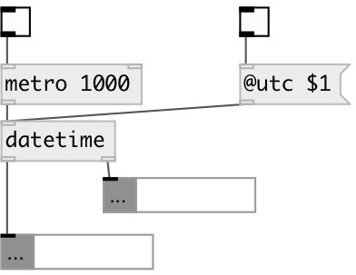

[index](index.html) :: [base](category_base.html)
---

# chrono.datetime

###### output current date and time info

*доступно с версии:* 0.9.6

---

## свойства:

* **@utc** 
Запросить/установить output in UTC format 
_тип:_ bool 
_по умолчанию:_ 0 

## входы:

* output HOUR MIN SEC to second outlet and YEAR MONTH DAY to first outlet 
_тип:_ control

## выходы:

* list: YEAR MONTH DAY 
_тип:_ control
* list: HOUR MIN SEC 
_тип:_ control

## ключевые слова:

[base](keywords/base.html)

**Авторы:** Serge Poltavsky

**Лицензия:** GPL3 or later

