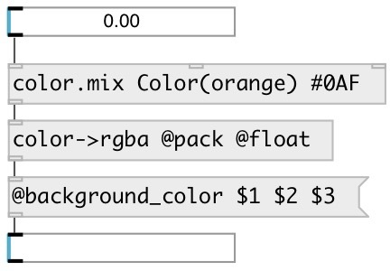

[index](index.html) :: [data](category_data.html)
---

# color.mix

###### color mixer

*доступно с версии:* 0.9.7

---

## аргументы:

* **C0**
first color 
_тип:_ atom 

* **C1**
second value 
_тип:_ atom 

## свойства:

* **@c0** 
Запросить/установить first color 
_тип:_ atom 

* **@c1** 
Запросить/установить second color 
_тип:_ atom 

## входы:

* calculate color mix and output 
_тип:_ control
* set color and output 
_тип:_ control
* set color without output 
_тип:_ control

## выходы:

* data:color output 
_тип:_ control

## ключевые слова:

[data](keywords/data.html)
[color](keywords/color.html)

**Авторы:** Serge Poltavsky

**Лицензия:** GPL3 or later

