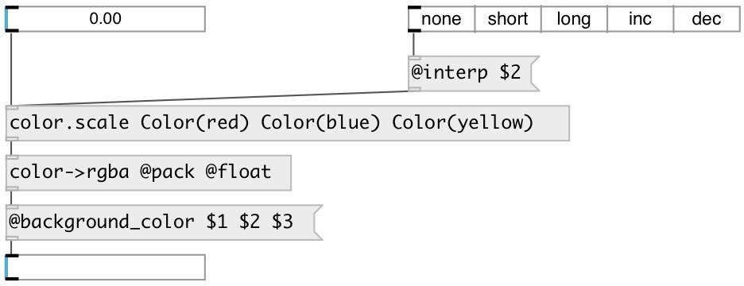

[index](index.html) :: [data](category_data.html)
---

# color.scale

###### create color scales

*доступно с версии:* 0.9.7

---

## аргументы:

* **SCALE**
color list 
_тип:_ list 

## свойства:

* **@scale** 
Запросить/установить color list 
_тип:_ list 

* **@mode** 
Запросить/установить output mode: if &#39;color&#39; - output as data:color type, if &#39;hex&#39; - output as hex
value, if &#39;rgb&#39; - RGB list 
_тип:_ symbol 
_варианты:_ color, hex, rgb 
_по умолчанию:_ color 

* **@color** 
Запросить/установить alias to @mode color 
_тип:_ alias 

* **@rgb** 
Запросить/установить alias to @mode rgb 
_тип:_ alias 

* **@hex** 
Запросить/установить alias to @mode hex 
_тип:_ alias 

* **@interp** 
Запросить/установить hue interpolation strategy 
_тип:_ symbol 
_варианты:_ none, short, long, inc, dec 
_по умолчанию:_ none 

## входы:

* calculate color scale hue and output 
_тип:_ control

## выходы:

* data:color output 
_тип:_ control

## ключевые слова:

[data](keywords/data.html)
[color](keywords/color.html)
[scale](keywords/scale.html)

**Авторы:** Serge Poltavsky

**Лицензия:** GPL3 or later

