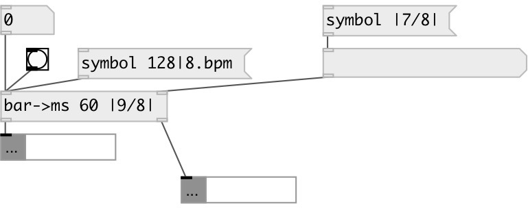

[index](index.html) :: [conv](category_conv.html)
---

# conv.bar2ms

###### calculate bar and beat duration

*доступно с версии:* 0.9.7

---

## информация
Example tempo values: 60, 120bpm, 90|4bpm, 80|3/8bpm Example time signature values: |3/8|, |1/4+3/16|

## аргументы:

* **BPM**
init tempo BPM value 
_тип:_ symbol 
_единица:_ bpm 

* **TSIG**
init time signature value 
_тип:_ symbol 

## свойства:

* **@bpm** 
Запросить/установить tempo bpm value 
_тип:_ symbol 
_единица:_ bpm 
_по умолчанию:_ 60|4bpm 

* **@tsig** 
Запросить/установить time signature value 
_тип:_ symbol 
_по умолчанию:_ |4/4| 

## входы:

* output bar and beat duration 
_тип:_ control
* set time signature 
_тип:_ control

## выходы:

* bar period in milliseconds 
_тип:_ control
* beat period in milliseconds 
_тип:_ control

## ключевые слова:

[conv](keywords/conv.html)
[time](keywords/time.html)
[duration](keywords/duration.html)
[tempo](keywords/tempo.html)
[bpm](keywords/bpm.html)

**Смотрите также:**
[\[conv.bpm2ms\]](conv.bpm2ms.html)

**Авторы:** Serge Poltavsky

**Лицензия:** GPL3 or later

