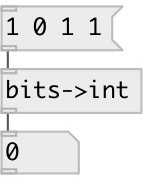

[index](index.html) :: [conv](category_conv.html)
---

# conv.bits2int

###### convert list of bits to integer

*доступно с версии:* 0.9.2

---

## информация
Note: byte default the least significant bit is the rightmost, this can be changed with @rev property

## свойства:

* **@rev** 
Получить/установить reversed bit order 
_тип:_ int 
_варианты:_ 0, 1 
_по умолчанию:_ 0 

## входы:

* input bit list 
_тип:_ control

## выходы:

* list of bits 
_тип:_ control

## ключевые слова:

[conv](keywords/conv.html)
[bits](keywords/bits.html)
[int](keywords/int.html)

**Смотрите также:**
[\[conv.int2bits\]](conv.int2bits.html)

**Авторы:** Serge Poltavsky

**Лицензия:** GPL3 or later

