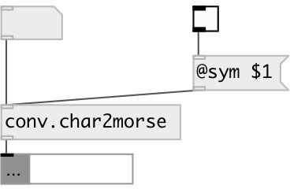

[index](index.html) :: [conv](category_conv.html)
---

# conv.char2morse

###### convert character to morse code

*доступно с версии:* 0.9.7

---

## информация
Note: cyrillic utf-8 characters are also supported.

## свойства:

* **@sym** 
Запросить/установить symbol output mode. If on - output as list of dots and dashes, otherwise as 0
and 1. 
_тип:_ bool 
_по умолчанию:_ 0 

## входы:

* single characted 
_тип:_ control

## выходы:

* list of 0 and 1 (or dots and dashes) 
_тип:_ control

## ключевые слова:

[conv](keywords/conv.html)
[char](keywords/char.html)
[morse](keywords/morse.html)

**Смотрите также:**
[\[proto.morse\]](proto.morse.html)

**Авторы:** Serge Poltavsky

**Лицензия:** GPL3 or later

