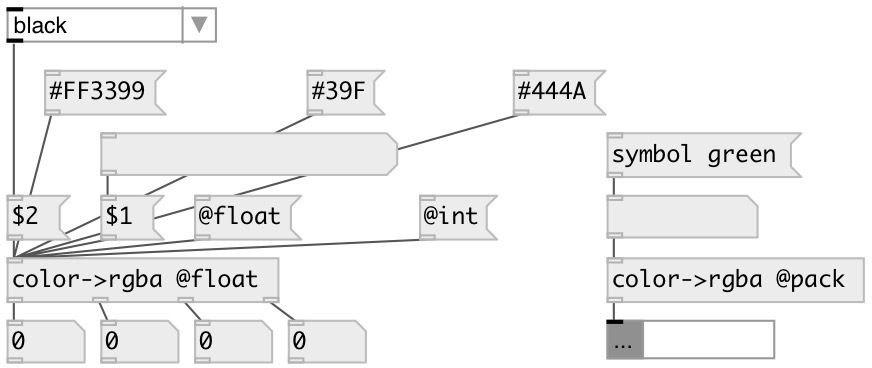

[index](index.html) :: [conv](category_conv.html)
---

# conv.color2rgba

###### convert named or hex color to separate RGBA values

*доступно с версии:* 0.9.7

---

## информация
Supported named colors are: black blue cyan gold gray green lime magenta navy olive orange pink purple red white yellow

## свойства:

* **@pack** (initonly)
Запросить/установить output as list to first outlet 
_тип:_ flag 

* **@mode** 
Запросить/установить output mode 
_тип:_ symbol 
_варианты:_ int, float 
_по умолчанию:_ int 

* **@int** 
Запросить/установить alias to @mode int. Output values in [0-255] range 
_тип:_ alias 

* **@float** 
Запросить/установить alias to @mode float. Output values in [0-1] range 
_тип:_ alias 

## входы:

* color name or hex value in full (#RRGGBB or #RRGGBBAA) or short (#RGB or #RGBA) format 
_тип:_ control

## выходы:

* list if @pack flag specified or int[0-255] or float[0-1]: red channel value 
_тип:_ control
* int[0-255] or float[0-1]: green channel value 
_тип:_ control
* int[0-255] or float[0-1]: blue channel value 
_тип:_ control
* int[0-255] or float[0-1]: alpha channel value 
_тип:_ control

## ключевые слова:

[conv](keywords/conv.html)
[color](keywords/color.html)
[hex](keywords/hex.html)
[rgb](keywords/rgb.html)
[rgba](keywords/rgba.html)

**Авторы:** Serge Poltavsky

**Лицензия:** GPL3 or later

