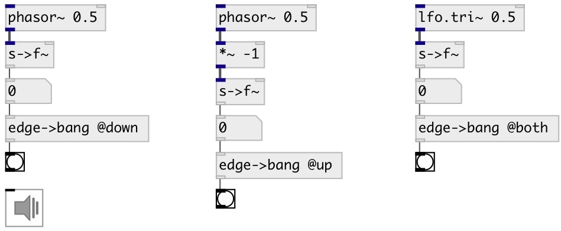

[index](index.html) :: [conv](category_conv.html)
---

# conv.edge2bang

###### edge detector for numeric stream

*доступно с версии:* 0.9.4

---

## свойства:

* **@mode** 
Запросить/установить edge detection mode 
_тип:_ symbol 
_варианты:_ up, down, both 
_по умолчанию:_ up 

* **@up** 
Запросить/установить alias to @mode up 
_тип:_ alias 

* **@down** 
Запросить/установить alias to @mode down 
_тип:_ alias 

* **@both** 
Запросить/установить alias to @mode both 
_тип:_ alias 

## входы:

* input value 
_тип:_ control

## выходы:

* bang: on edge 
_тип:_ control

## ключевые слова:

[conv](keywords/conv.html)
[edge](keywords/edge.html)
[detector](keywords/detector.html)

**Авторы:** Serge Poltavsky

**Лицензия:** GPL3 or later

