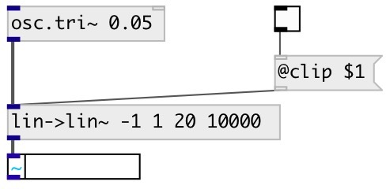

[index](index.html) :: [conv](category_conv.html)
---

# conv.lin2lin~

###### convert from one linear range to another for signals

*доступно с версии:* 0.9

---

## аргументы:

* **FROM**
begin of input range 
_тип:_ float 

* **TO**
end of input range 
_тип:_ float 

* **FROM**
begin of output range 
_тип:_ float 

* **TO**
end of input output 
_тип:_ float 

## свойства:

* **@in_from** 
Получить/установить begin of input range 
_тип:_ float 
_по умолчанию:_ -1 

* **@in_to** 
Получить/установить end of input range 
_тип:_ float 
_по умолчанию:_ 1 

* **@out_from** 
Получить/установить begin of output range 
_тип:_ float 
_по умолчанию:_ -1 

* **@out_to** 
Получить/установить end of output range 
_тип:_ float 
_по умолчанию:_ 1 

* **@clip** 
Получить/установить noclip (don&#39;t clip) max (clip ceiling) min (clip floor) minmax (clip both). 
_тип:_ symbol 
_варианты:_ noclip, min, max, minmax 
_по умолчанию:_ minmax 

* **@noclip** 
Получить/установить alias to @clip noclip 
_тип:_ symbol 

* **@min** 
Получить/установить alias to @clip min 
_тип:_ symbol 

* **@max** 
Получить/установить alias to @clip max 
_тип:_ symbol 

* **@minmax** 
Получить/установить alias to @clip minmax 
_тип:_ symbol 

## входы:

* input singnal 
_тип:_ audio

## выходы:

* converted signal 
_тип:_ audio

## ключевые слова:

[convert](keywords/convert.html)
[linear](keywords/linear.html)

**Смотрите также:**
[\[conv.lin2lin\]](conv.lin2lin.html)

**Авторы:** Serge Poltavsky

**Лицензия:** GPL3 or later

