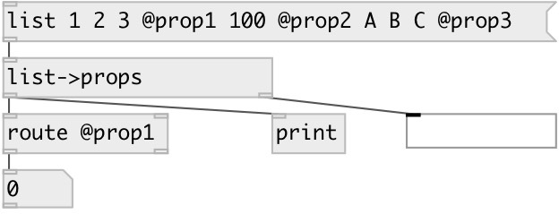

[index](index.html) :: [conv](category_conv.html)
---

# conv.list2props

###### преобразует список в серию свойств-сообщений

*доступно с версии:* 0.7

---

## входы:

* list of properties 
_тип:_ control

## выходы:

* sequence of @prop messages 
_тип:_ control
* list of non prop arguments 
_тип:_ control

## ключевые слова:

[conv](keywords/conv.html)
[properties](keywords/properties.html)

**Авторы:** Serge Poltavsky

**Лицензия:** GPL3 or later

