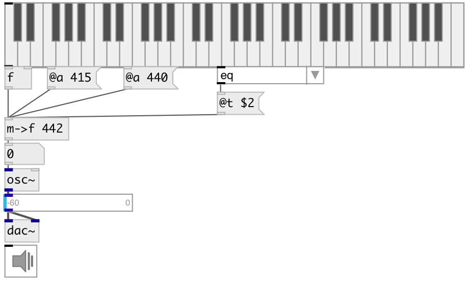

[index](index.html) :: [conv](category_conv.html)
---

# conv.midi2freq

###### convert from midi pitch to frequency in hz (with various base A and temperament)

*доступно с версии:* 0.6

---

## аргументы:

* **APITCH**
pitch standard 
_тип:_ float 

## свойства:

* **@a** 
Получить/установить A pitch frequency 
_тип:_ float 
_единица:_ Hz 
_диапазон:_ 200..600 
_по умолчанию:_ 440 

* **@t** 
Получить/установить temperament 
_тип:_ symbol 
_варианты:_ eq, just, ganassi, meantone, kirnberger3, pythagorean, rameau, valotti, zarlino 
_по умолчанию:_ eq 

## входы:

* input MIDI pitch 
_тип:_ control

## выходы:

* converted value 
_тип:_ control

## ключевые слова:

[conv](keywords/conv.html)
[freq](keywords/freq.html)
[midi](keywords/midi.html)

**Смотрите также:**
[\[mtof\]](mtof.html)

**Авторы:** Serge Poltavsky

**Лицензия:** GPL3 or later

