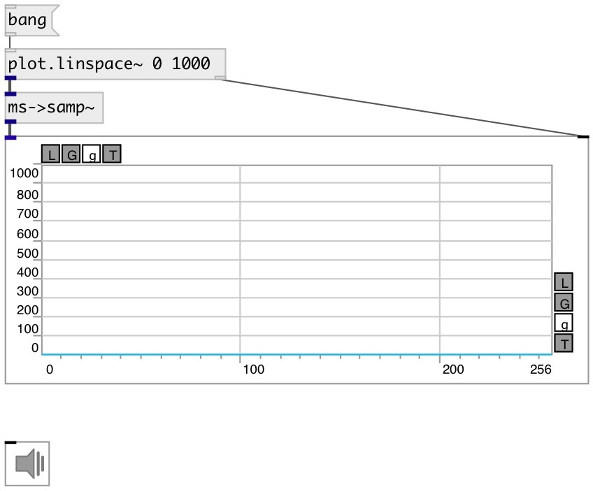

[index](index.html) :: [conv](category_conv.html)
---

# conv.ms2samp~

###### convert time in milliseconds to number of samples according to current samplerate

*доступно с версии:* 0.9

---

## входы:

* input signal 
_тип:_ audio

## выходы:

* output signal 
_тип:_ audio

## ключевые слова:

[conv](keywords/conv.html)
[samp](keywords/samp.html)
[ms](keywords/ms.html)

**Смотрите также:**
[\[conv.samp2ms~\]](conv.samp2ms~.html)

**Авторы:** Serge Poltavsky

**Лицензия:** GPL3 or later

