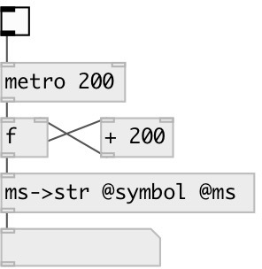

[index](index.html) :: [conv](category_conv.html)
---

# conv.ms2str

###### converts float time in milliseconds to formated symbol (or string)

*доступно с версии:* 0.9.7

---

## свойства:

* **@ms** (initonly)
Запросить/установить output milliseconds 
_тип:_ flag 
_по умолчанию:_ 0 

* **@symbol** (initonly)
Запросить/установить if specified - output formatted time as symbol, otherwise as string. 
_тип:_ flag 
_по умолчанию:_ 0 

## входы:

* converts float value in milliseconds to formatted symbol 
_тип:_ control

## выходы:

* time in format &#34;HH:MM::SS&#34; or &#34;HH:MM:SS.XXX&#34; 
_тип:_ control

## ключевые слова:

[conv](keywords/conv.html)
[time](keywords/time.html)

**Смотрите также:**
[\[conv.sec2str\]](conv.sec2str.html)

**Авторы:** Serge Poltavsky

**Лицензия:** GPL3 or later

