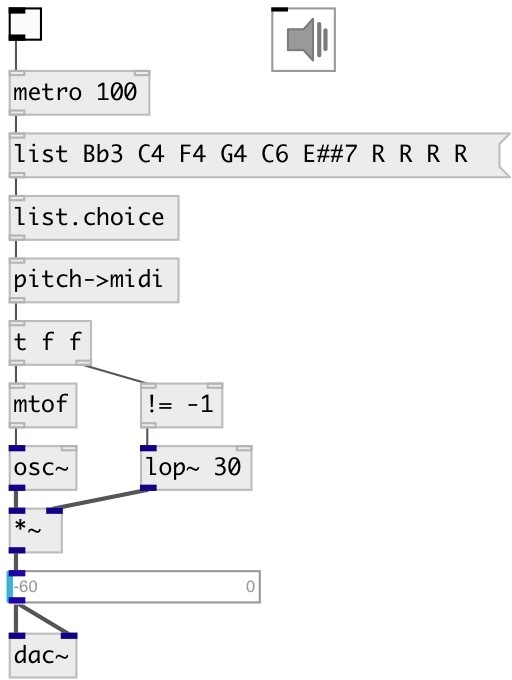

[index](index.html) :: [conv](category_conv.html)
---

# conv.pitch2midi

###### converts symbol pitch name to MIDI note number

*доступно с версии:* 0.4

---

## информация
Convert Scientific Pitch Notation to MIDI note numbers. SPN consist of pitch class (C, C#, D, Eb etc.) and octave (0-9). C4 is middle C (MIDI: 60). The rest symbol is R (-1 output)

## входы:

* Scientific Pitch Notation value 
_тип:_ control

## выходы:

* MIDI note number or -1 on Rest 
_тип:_ control

## ключевые слова:

[conv](keywords/conv.html)
[pitch](keywords/pitch.html)
[midi](keywords/midi.html)

**Авторы:** Serge Poltavsky

**Лицензия:** GPL3 or later

