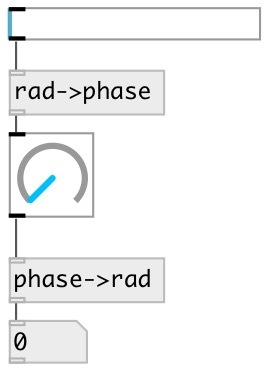

[index](index.html) :: [conv](category_conv.html)
---

# conv.rad2phase

###### convert radians value to phase

*доступно с версии:* 0.8

---

## входы:

* input value 
_тип:_ control

## выходы:

* converted value 
_тип:_ control

## ключевые слова:

[conv](keywords/conv.html)
[phase](keywords/phase.html)
[radians](keywords/radians.html)

**Смотрите также:**
[\[conv.phase2rad\]](conv.phase2rad.html)

**Авторы:** Serge Poltavsky

**Лицензия:** GPL3 or later

