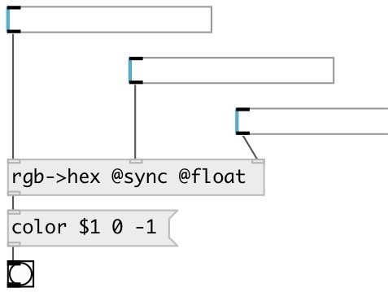

[index](index.html) :: [conv](category_conv.html)
---

# conv.rgb2hex

###### convert separate RGB values to hex color

*доступно с версии:* 0.9.7

---

## свойства:

* **@mode** 
Запросить/установить input mode 
_тип:_ symbol 
_варианты:_ int, float 
_по умолчанию:_ int 

* **@int** 
Запросить/установить alias to @mode int. Expected input values are in [0-255] range 
_тип:_ alias 

* **@float** 
Запросить/установить alias to @mode float. Expected input values are in [0-1] range 
_тип:_ alias 

* **@sync** (initonly)
Запросить/установить output value on any inlet change 
_тип:_ flag 

## входы:

* red channel value in [0-255] range 
_тип:_ control
* green channel value in [0-255] range 
_тип:_ control
* blue channel value in [0-255] range 
_тип:_ control

## выходы:

* symbol: #RRGGBB color value 
_тип:_ control

## ключевые слова:

[conv](keywords/conv.html)
[color](keywords/color.html)
[hex](keywords/hex.html)
[rgb](keywords/rgb.html)
[rgba](keywords/rgba.html)

**Авторы:** Serge Poltavsky

**Лицензия:** GPL3 or later

